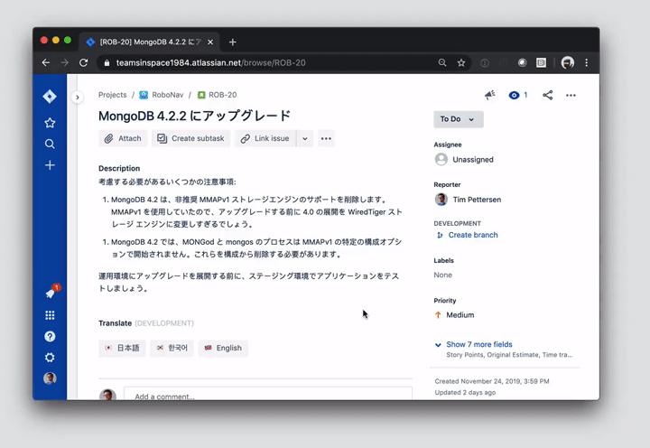

# Forge Sketch2Code

[](LICENSE)

This is [Forge](https://developer.atlassian.com/platform/forge/) app that transforms UI Sketches into Working HTML Pages. You can transform attachments in Jira issues or provide URL in a confluence macro to transform your sketches into working responsive web page.

## Usage

Press the corresponding button on the issue view to translate the issue attachments into their respective Web page.



This app is designed as a Forge reference example for developers. There are no user-facing configuration options, but you can modify the supported languages and translated fields by editing `src/index.jsx`.

## Installation

1. Follow the instructions on [Example Apps](https://developer.atlassian.com/platform/forge/example-apps/) to copy, deploy, and install this Forge app.
1. [Sign up for the Azure Translator Text API](https://docs.microsoft.com/en-us/azure/cognitive-services/translator/translator-text-how-to-signup) (the free tier allows 2 million characters per month at time of writing) and copy your **Authentication key**.
1. Set an encrypted [environment variable](https://developer.atlassian.com/platform/forge/environments/) keyed by `TRANSLATE_API_KEY` with a value of your Translator Text API **Authentication key**. `forge variables:set --encrypt TRANSLATE_API_KEY xxxxxxxxxx`.
1. Run `forge deploy` to deploy the changes to your environment variables.
1. You're done! Test out the app by browsing to a Jira issue and clicking one of the buttons on the "Translate" panel.

## Debugging

You can enable verbose logging by setting the `DEBUG_LOGGING` [environment variable](https://developer.atlassian.com/platform/forge/environments/) to `1`. Logs can then be viewed with the `forge logs` command.

Alternatively, you can use the [`forge tunnel`](https://developer.atlassian.com/platform/forge/change-the-frontend-with-forge-ui/#set-up-tunneling) command to run your Forge app locally. Note that you must pass the environment variable values to the tunnel with the prefix `FORGE_USER_VAR_`, e.g.:

```
FORGE_USER_VAR_TRANSLATE_API_KEY=your_translate_api_key_here FORGE_USER_VAR_DEBUG_LOGGING=1 forge tunnel
```

## License

Copyright (c) 2020 Atlassian and others.
Apache 2.0 licensed, see [LICENSE](LICENSE) file.

[](https://www.atlassian.com)
